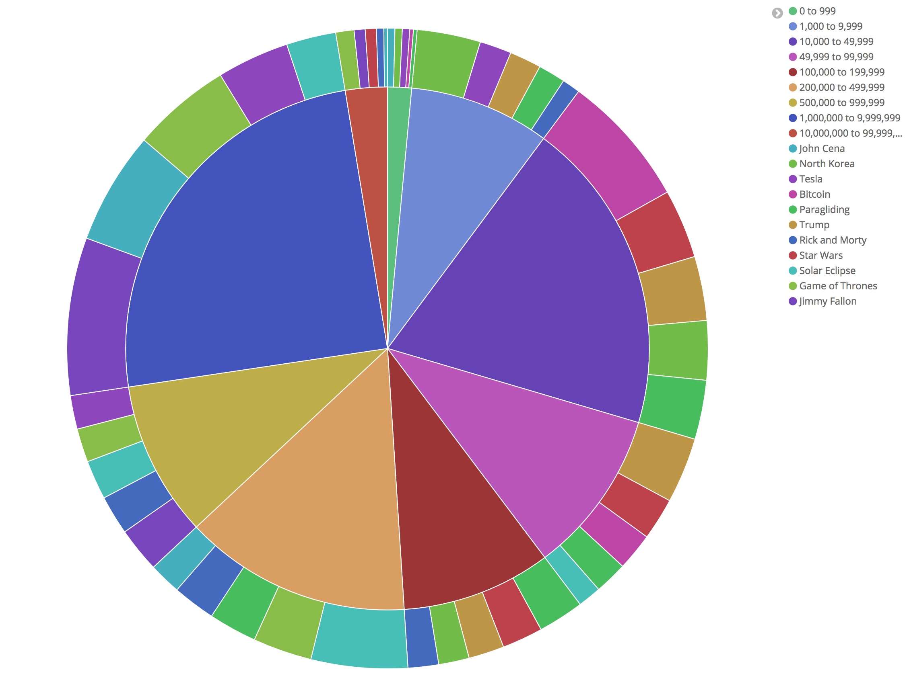

# red-flask

This repository contains the source code for the Flask Application that fetches YouTube meta data from [YouTube Data API](https://developers.google.com/youtube/v3/getting-started).
 The data fetched is then indexed and inserted into Elasticsearch. Kibana dashboard is linked with [Elasticsearch](https://www.elastic.co/products/elasticsearch) for 
 data visualisation.
 
 The architecture is represented by this.  
 
 

#### Data Collection and Processing:
Data was collected in the following steps:

*  `/search` API takes `query` and `max_result` in request and fetches the list of matching video IDs from the [YouTube Search API](https://developers.google.com/youtube/v3/docs/search)
*  The video IDs are then queried to [YouTube Videos API](https://developers.google.com/youtube/v3/docs/videos) to get video meta data
*  For each video meta data, I go and fetch channel data with [YouTube Channel API](https://developers.google.com/youtube/v3/docs/channels)
*  YouTube Video API gives the video duration in [ISO 8601](https://www.wikiwand.com/en/ISO_8601#/Durations) format. So, I converted the video duration into seconds for better processing and visualisation
*  The aggregated document is then indexed and inserted in the Elasticsearch

A typical Elasticsearch video meta document looked like:

```
{
  "_index": "video",
  "_type": "meta",
  "_id": "AV4U9ET77popmOQYn_dd",
  "_version": 1,
  "_score": null,
  "_source": {
    "id": "VgL_Y22eG2Q",
    "contentDetails": {
      "projection": "rectangular",
      "licensedContent": false,
      "definition": "sd",
      "dimension": "2d",
      "duration": 601,
      "caption": "false"
    },
    "etag": "\"m2yskBQFythfE4irbTIeOgYYfBU/SCJFBrU0ZvOCnguuYzMcviSI8dQ\"",
    "recordingDetails": {
      "recordingDate": "2017-08-24T00:00:00.000Z"
    },
    "snippet": {
      "channelTitle": "SK-Styles",
      "localized": {
        "title": "John Cena Regresa a Raw Y Confronta a Roman Reigns: Raw 21/08/2017 | Español Latino",
        "description": "John Cena Regresa a Raw Y Confronta a Roman Reigns: WWE Raw, 21 de Agosto, 2017 en Español Latino\nJohn Cena Returns to Raw And Confronts Roman Reigns: WWE Raw, August 21, 2017\n#RAW\n➤Comentaristas: Carlos Cabrera Y Marcelo Rodriguez\n▬▬▬▬▬▬▬▬▬▬▬▬▬▬▬▬▬▬\n➤Si el video te gustó no olvides en SUSCRIBIRTE ✅ para seguir viendo más videos de este tipo. Apóyame con un simple LIKE 👍 y COMPARTELO con tus amigos ❤ Gracias!\n▬▬▬▬▬▬▬▬▬▬▬▬▬▬▬▬▬▬\nMis Redes Sociales:\n➤Twitter: http://twitter.com/SKStylesha\n➤Google+: https://plus.google.com/u/0/b/102972717289002020426/102972717289002020426\n▬▬▬▬▬▬▬▬▬▬▬▬▬▬▬▬▬▬\n➤WWE Pagina Oficial (Spanish): http://espanol.wwe.com/\n➤WWE Official Page (English): http://www.wwe.com/\n▬▬▬▬▬▬▬▬▬▬▬▬▬▬▬▬▬▬\nAll WWE programming, talent names, images, likenesses, slogans, wrestling moves, trademarks, logos and copyrights are the exclusive property of WWE, Inc. and its subsidiaries. All other trademarks, logos and copyrights are the property of their respective owners. © 2017 WWE, Inc. All Rights Reserved. This website is based in the United States. By submitting personal information to this website you consent to your information being maintained in the U.S., subject to applicable U.S. laws. U.S. law may be different than the law of your home country. WrestleMania logo TM & © 2017 WWE. All Rights Reserved\nCopyright Disclaimer Under Section 107 of the Copyright Act 1976, allowance is made for \"fair use\" for purposes such as criticism, comment, news reporting, teaching, scholarship, and research. Fair use is a use permitted by copyright statute that might otherwise be infringing. Non-profit, educational or personal use tips the balance in favor of fair use"
      },
      "categoryId": "24",
      "tags": [
        "wwe",
        "WWE",
        "#RAW",
        "SK-Styles",
        "2017",
        "raw",
        "wwe en español",
        "en",
        "español",
        "latino",
        "completo",
        "john cena",
        "roman reigns",
        "samoa joe",
        "miz",
        "wwe john cena regresa 2017",
        "wwe john cena returns 2017 en español",
        "regresa",
        "returns",
        "confronta",
        "lo ultimo",
        "lo mas nuevo",
        "world wrestling entertainment",
        "wrestling",
        "wrestler",
        "wrestle",
        "superstars",
        "कुश्ती",
        "पहलवान",
        "डब्लू डब्लू ई",
        "सुपरस्टार",
        "व्यावसायिक कुश्ती",
        "highlights",
        "مصارعه",
        "vs",
        "wwe raw",
        "confronts",
        "wwe raw 21 de agosto 2017",
        "español latino",
        "#SDLive",
        "john",
        "cena",
        "roman",
        "reigns",
        "samoa",
        "joe"
      ],
      "publishedAt": "2017-08-24T14:39:52.000Z",
      "liveBroadcastContent": "none",
      "title": "John Cena Regresa a Raw Y Confronta a Roman Reigns: Raw 21/08/2017 | Español Latino",
      "defaultLanguage": "es-419",
      "description": "John Cena Regresa a Raw Y Confronta a Roman Reigns: WWE Raw, 21 de Agosto, 2017 en Español Latino\nJohn Cena Returns to Raw And Confronts Roman Reigns: WWE Raw, August 21, 2017\n#RAW\n➤Comentaristas: Carlos Cabrera Y Marcelo Rodriguez\n▬▬▬▬▬▬▬▬▬▬▬▬▬▬▬▬▬▬\n➤Si el video te gustó no olvides en SUSCRIBIRTE ✅ para seguir viendo más videos de este tipo. Apóyame con un simple LIKE 👍 y COMPARTELO con tus amigos ❤ Gracias!\n▬▬▬▬▬▬▬▬▬▬▬▬▬▬▬▬▬▬\nMis Redes Sociales:\n➤Twitter: http://twitter.com/SKStylesha\n➤Google+: https://plus.google.com/u/0/b/102972717289002020426/102972717289002020426\n▬▬▬▬▬▬▬▬▬▬▬▬▬▬▬▬▬▬\n➤WWE Pagina Oficial (Spanish): http://espanol.wwe.com/\n➤WWE Official Page (English): http://www.wwe.com/\n▬▬▬▬▬▬▬▬▬▬▬▬▬▬▬▬▬▬\nAll WWE programming, talent names, images, likenesses, slogans, wrestling moves, trademarks, logos and copyrights are the exclusive property of WWE, Inc. and its subsidiaries. All other trademarks, logos and copyrights are the property of their respective owners. © 2017 WWE, Inc. All Rights Reserved. This website is based in the United States. By submitting personal information to this website you consent to your information being maintained in the U.S., subject to applicable U.S. laws. U.S. law may be different than the law of your home country. WrestleMania logo TM & © 2017 WWE. All Rights Reserved\nCopyright Disclaimer Under Section 107 of the Copyright Act 1976, allowance is made for \"fair use\" for purposes such as criticism, comment, news reporting, teaching, scholarship, and research. Fair use is a use permitted by copyright statute that might otherwise be infringing. Non-profit, educational or personal use tips the balance in favor of fair use",
      "defaultAudioLanguage": "zxx",
      "thumbnails": {
        "high": {
          "width": 480,
          "height": 360,
          "url": "https://i.ytimg.com/vi/VgL_Y22eG2Q/hqdefault.jpg"
        },
        "medium": {
          "width": 320,
          "height": 180,
          "url": "https://i.ytimg.com/vi/VgL_Y22eG2Q/mqdefault.jpg"
        },
        "default": {
          "width": 120,
          "height": 90,
          "url": "https://i.ytimg.com/vi/VgL_Y22eG2Q/default.jpg"
        },
        "standard": {
          "width": 640,
          "height": 480,
          "url": "https://i.ytimg.com/vi/VgL_Y22eG2Q/sddefault.jpg"
        },
        "maxres": {
          "width": 1280,
          "height": 720,
          "url": "https://i.ytimg.com/vi/VgL_Y22eG2Q/maxresdefault.jpg"
        }
      },
      "channelId": "UCIap7b4W3L18c7HfkyMHvnA"
    },
    "status": {
      "privacyStatus": "public",
      "license": "youtube",
      "embeddable": true,
      "publicStatsViewable": true,
      "uploadStatus": "processed"
    },
    "query": "John Cena",
    "kind": "youtube#video",
    "channel": {
      "hiddenSubscriberCount": false,
      "subscriberCount": "62875",
      "commentCount": "0",
      "viewCount": "20307834",
      "videoCount": "235"
    },
    "statistics": {
      "favoriteCount": "0",
      "dislikeCount": "0",
      "likeCount": "31",
      "commentCount": "6",
      "viewCount": "310"
    }
  },
  "fields": {
    "snippet.publishedAt": [
      1503585592000
    ],
    "recordingDetails.recordingDate": [
      1503532800000
    ],
    "contentDetails.duration": [
      601
    ]
  },
  "sort": [
    1503585592000
  ]
}
```
#### Data Visualisation:
For visualisation, I turned to [Kibana](https://www.elastic.co/products/kibana) because of its seamless integration with Elasticsearch. It was my one stop shop for data exploration and visualisation. It provides with `Dev Tools` to run queries on your data and different graphs for visualisation.
I used Pie Chart, Line Graph, Tag Cloud and Bar graphs to show the data on the dashboard.

A snapshot of the Pie Chart with buckets of video view count and sub-buckets of the query word:



#### Data Training:
 
For training, I have used a Linear Regression model over the collected data.
The input features are:

* Video View Count
* Video Comment Count
* Video Dislike Count
* Video Favourite Count
* Channel Video Count
* Channel Subscriber Count

The model tries to fit a line through the data and predict the number of like given a YouTube URL.