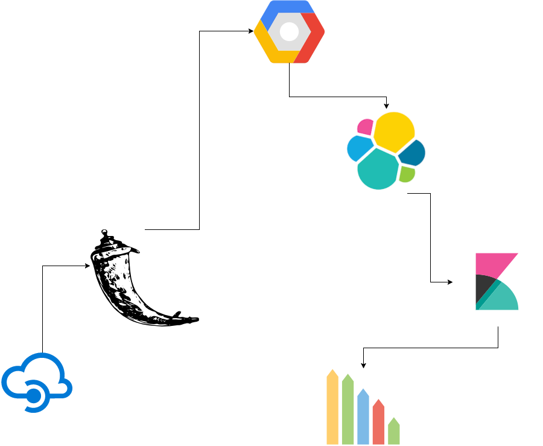

# red-flask

This repository contains the source code for the Flask Application that fetches Youtube meta data from Youtube Data API.
 The data fetched is then indexed and inserted into Elasticsearch. Kibana dashboard is linked with Elasticsearch for 
 data visualisation.
 
 The model is represented by this.  
 
 
 
 
For training, I have used a Linear Regression model over the collected data.
The input features are:

* Video View Count
* Video Comment Count
* Video Dislike Count
* Video Favourite Count
* Channel Video Count
* Channel Subscriber Count

The model tries to fit a line through the data and predict the number of like given a Youtube Url.